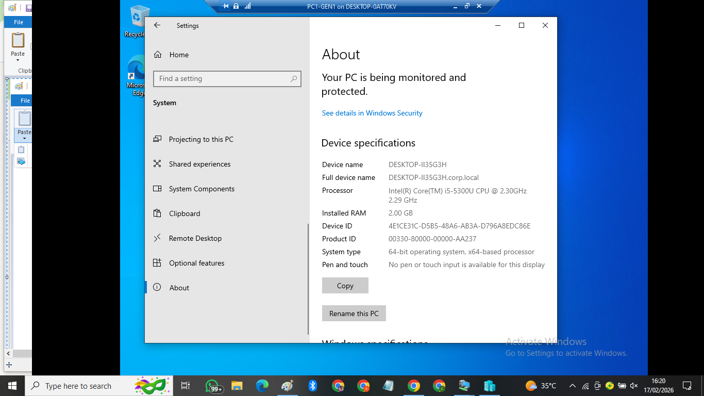
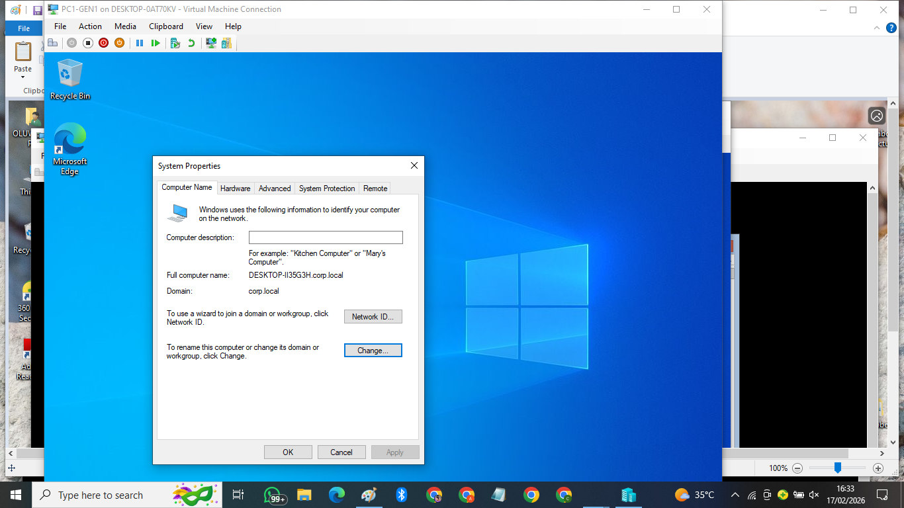

## Active Directory Home Lab (Windows Server + Windows 10)

## Overview
Built a small corporate-style Active Directory environment to demonstrate common helpdesk tasks:
- Active Directory user and group management
- Domain join and domain logon verification
- Password policy / account actions (password change at next logon)
- Group Policy configuration (USB storage restriction)
- **Skills:** Active Directory, DNS, GPO, Domain Join, Account Management, Windows Troubleshooting

## Lab Environment
- **Host:** Windows 10 Pro (Hyper-V)
- **Domain Controller:** Windows Server 2022 (Server Core) — `DC1`
- **Client:** Windows 10 VM — domain joined
- **Domain:** `corp.local`
- **Network:** Internal virtual switch (LabSwitch), static IP addressing

## What I Configured / Demonstrated
### Active Directory (AD)
- Created OU structure under `Corp` (Users/Computers/Groups)
- Created users with department naming (IT/HR/Sales)
- Created security groups (GG_IT / GG_HR / GG_Sales) and assigned memberships

### Domain Join + Login
- Joined Windows 10 client to `corp.local`
- Logged in with a domain user and verified context (`whoami`)

### Group Policy
- Configured domain password policy (evidence screenshot)
- Created GPO to disable USB storage (USBSTOR) and generated a GPO report

## Evidence (Screenshots)
- [Screenshots folder](screenshots/)

### Key proof
- OU/group membership:  
  - [HR membership](screenshots/01-aduc-memberof-gg-hr.png)  
  - [Sales membership](screenshots/02-aduc-memberof-gg-sales.png)
- [Client joined to domain](screenshots/03-client-joined-corp-local.png)
- [Domain user proof (whoami)](screenshots/04-domain-user-whoami.png)
- [Password change at next logon](screenshots/05-password-change-next-logon.png)
- [Password policy proof](screenshots/06-password-policy.png)
- USB GPO report:  
  - [Part 1](screenshots/07-gpo-usb-report-1.png)  
  - [Part 2](screenshots/08-gpo-usb-report-2.png)
- [USB setting proof](screenshots/09-usb-disable-setting.png)

### Highlight (embedded)

## Ticket-Style Notes (Sample)
- Verified domain discovery and DNS configuration during domain join.
- Configured account settings to simulate password expiry (“must change at next logon”).
- Implemented USB storage restriction via Group Policy.

